# aws-eb-ccommit-route53-alb-ses-crons-laravel8jet 🐳


[](https://github.com/tquangdo/aws-eb-ccommit-route53-alb-ses-crons-laravel8jet/issues/new)

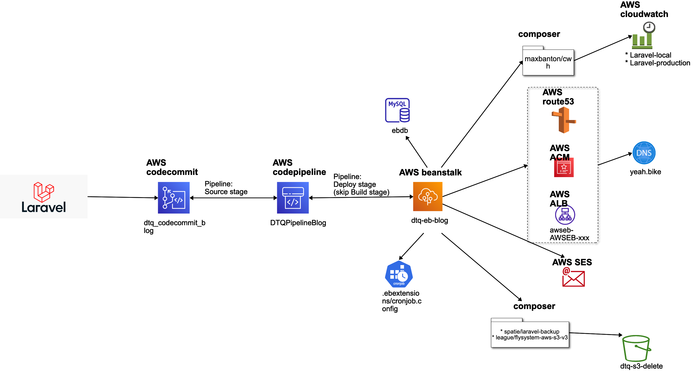

## reference
[youtube](https://www.youtube.com/watch?v=KtpiF3SUCkA)

## create Laravel project
```shell
php -v -> PHP 8.0.14
composer -v -> Composer version 2.2.4
laravel new aws-eb-ccommit-route53-alb-ses-crons-laravel8jet --jet
->
    |     |         |
    |,---.|--- ,---.|--- ,---.,---.,---.,-.-.
    ||---'|    `---.|    |    |---',---|| | |
`---'`---'`---'`---'`---'`    `---'`---^` ' '
Which Jetstream stack do you prefer?
  [0] livewire
  [1] inertia
 > 0
Will your application use teams? (yes/no) [no]:
 > 
npm i && npm run dev
php artisan migrate
php artisan serve
```
+ access `http://127.0.0.1:8000/` on browser OK!
> ⚠️WARNING!!!⚠️: need run `run dev` & `migrate` + access `127.0.0.1` before go to AWS!

## codecommit
+ name=`dtq_codecommit_blog`
```shell
git init
git remote add origin ssh://git-codecommit.us-east-1.amazonaws.com/v1/repos/dtq_codecommit_blog
git add .
git commit -m '1st'
git push -u origin master # if ERR use `git push -f origin master`
```
+ connect SSH: https://docs.aws.amazon.com/console/codecommit/connect-ssh-unix_np

## eb
+ name=`dtq-eb-blog`
+ choose platform `PHP8 Linux2` (nginx): MUST map with `composer.json > "php": "^7.x|^8.0",`
> ⚠️WARNING!!!⚠️: can NOT edit after created
+ Configuration >
+ 1. edit `Software` > Document root=`/public`
+ 2. edit `DB` > `mysql` > username=`admin` + PW=`xxx`
+ 3. `Environment properties` like: key=`APP_KEY` & value=`xxx`
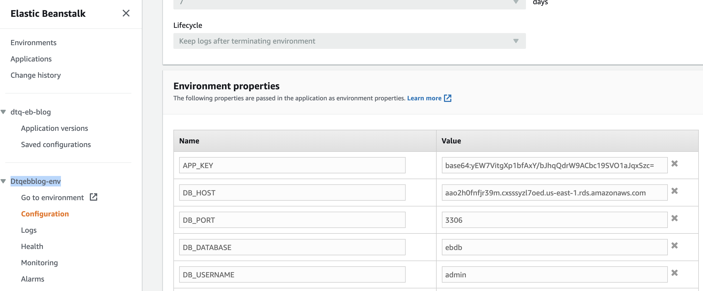
+ edit `config/app.php`:
```php
// 'key' => env('APP_KEY'),
'key' => array_key_exists('APP_KEY', $_SERVER) ? $_SERVER['APP_KEY'] : env('APP_KEY'),
```
+ edit `config/database.php`:
```php
// 'url' => env('DATABASE_URL'),
// 'host' => env('DB_HOST', '127.0.0.1'),
// 'port' => env('DB_PORT', '3306'),
// 'database' => env('DB_DATABASE', 'forge'),
// 'username' => env('DB_USERNAME', 'forge'),
// 'password' => env('DB_PASSWORD', ''),
'url' => array_key_exists('DATABASE_URL', $_SERVER) ? $_SERVER['DATABASE_URL'] : env('DATABASE_URL'),
'host' => array_key_exists('DB_HOST', $_SERVER) ? $_SERVER['DB_HOST'] : env('DB_HOST'),
'port' => array_key_exists('DB_PORT', $_SERVER) ? $_SERVER['DB_PORT'] : env('DB_PORT'),
'database' => array_key_exists('DB_DATABASE', $_SERVER) ? $_SERVER['DB_DATABASE'] : env('DB_DATABASE'),
'username' => array_key_exists('DB_USERNAME', $_SERVER) ? $_SERVER['DB_USERNAME'] : env('DB_USERNAME'),
'password' => array_key_exists('DB_PASSWORD', $_SERVER) ? $_SERVER['DB_PASSWORD'] : env('DB_PASSWORD'),
```
+ access eb's URL on browser OK!

### eb result
+ access eb's URL on browser > register > login > OK!
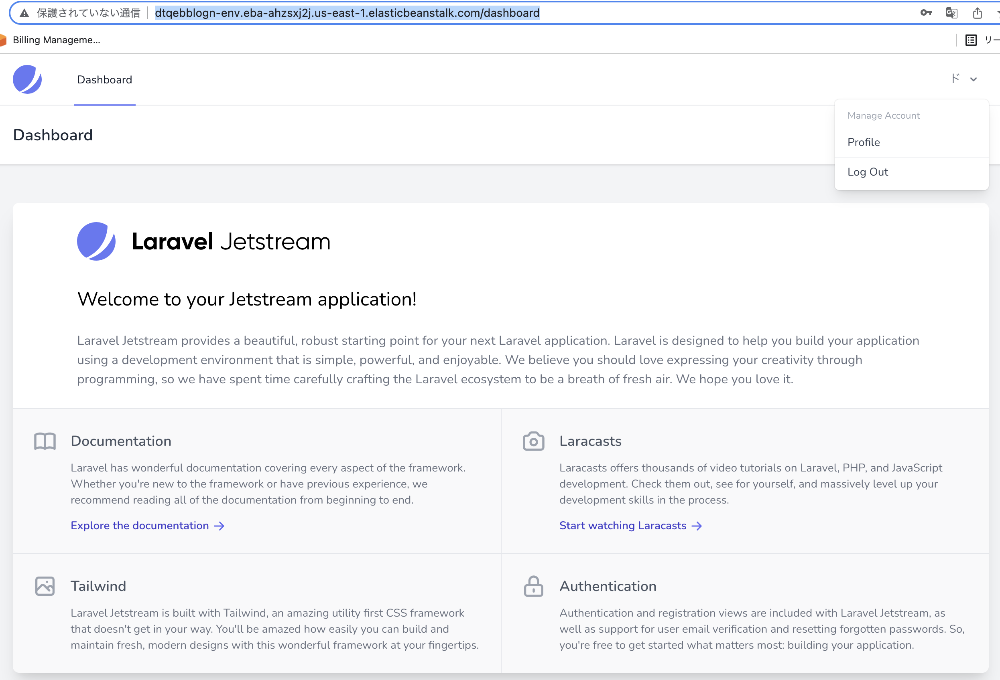

## cwatch
```shell
composer require maxbanton/cwh
```
+ edit `.env` & eb `dtq-eb-blog` > Configuration > edit `Software`:
```shell
LOG_CHANNEL=cloudwatch
...
AWS_ACCESS_KEY_ID=xxx
AWS_SECRET_ACCESS_KEY=yyy
AWS_DEFAULT_REGION=us-east-1
```
+ edit `config/logging.php`
```php
'cloudwatch' => [
          'driver' => 'custom',
          'via' => \App\Logging\CloudWatchLoggerFactory::class,
          'sdk' => [
            'region' => array_key_exists('AWS_DEFAULT_REGION', $_SERVER) ? $_SERVER['AWS_DEFAULT_REGION'] : env('AWS_DEFAULT_REGION', 'eu-west-1'),
            'version' => 'latest',
            'credentials' => [
              'key' => array_key_exists('AWS_ACCESS_KEY_ID', $_SERVER) ? $_SERVER['AWS_ACCESS_KEY_ID'] : env('AWS_ACCESS_KEY_ID'),
              'secret' => array_key_exists('AWS_SECRET_ACCESS_KEY', $_SERVER) ? $_SERVER['AWS_SECRET_ACCESS_KEY'] : env('AWS_SECRET_ACCESS_KEY'),
            ]
          ],
          'retention' => env('CLOUDWATCH_LOG_RETENTION', 30),
          'level' => env('CLOUDWATCH_LOG_LEVEL', 'error')
        ],
```
+ create file `app/Logging/CloudWatchLoggerFactory.php`
+ edit `routes/web.php`:
```php
Log::info('hey');
```
+ run CMD:
```shell
php artisan serve
```
+ access `127.0.0.1` on browser and see the result in CWatch:
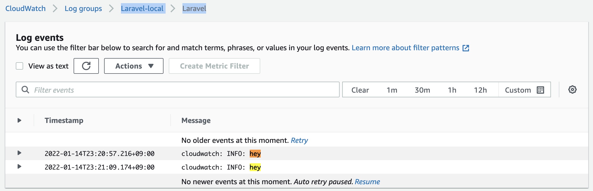
+ edit `config/logging.php`:
```php
'default' => array_key_exists('LOG_CHANNEL', $_SERVER) ? $_SERVER['LOG_CHANNEL'] : env('LOG_CHANNEL', 'cloudwatch'),
```
+ edit `config/app.php`:
```php
'env' => array_key_exists('APP_ENV', $_SERVER) ? $_SERVER['APP_ENV'] : env('APP_ENV'),
    'debug' => array_key_exists('APP_DEBUG', $_SERVER) ? ($_SERVER['APP_DEBUG'] === 'false' ? false : true) : env('APP_DEBUG'),
```
+ EB `dtq-eb-blog` > Configuration > edit `Software`:
```shell
APP_ENV=production
APP_DEBUG=false
```
+ push and access eb's URL on browser > see the result in CWatch:
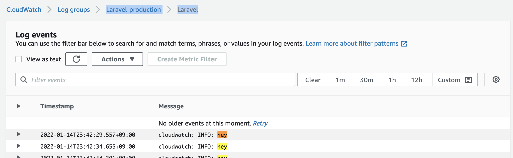

## route53
+ create hosted zone=`yeah.bike`
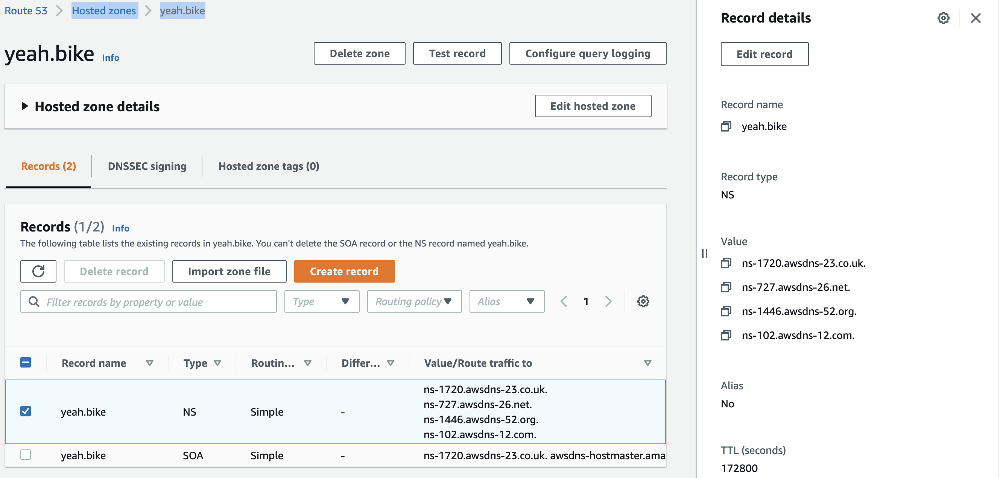

## ACM
+ click `request cert`
+ domain name=`yeah.bike` & `*.yeah.bike`
+ click `Create records in Route 53`
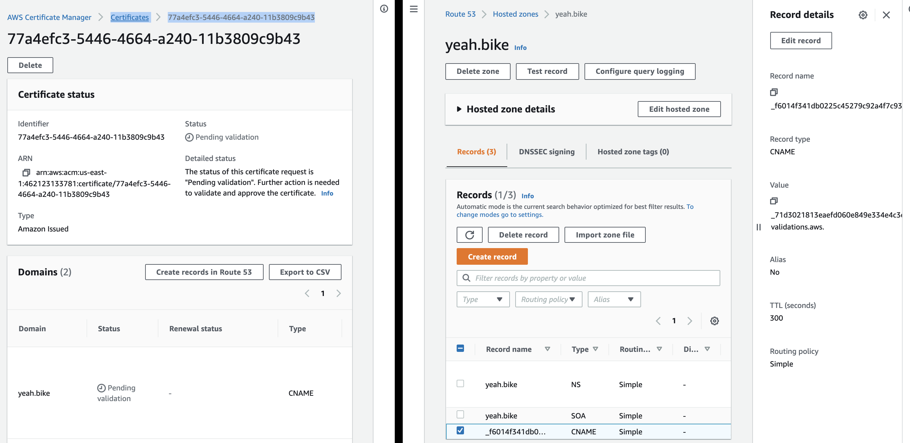

## EB
+ EB `dtq-eb-blog` > Configuration > edit `LB` > click `Add listener`
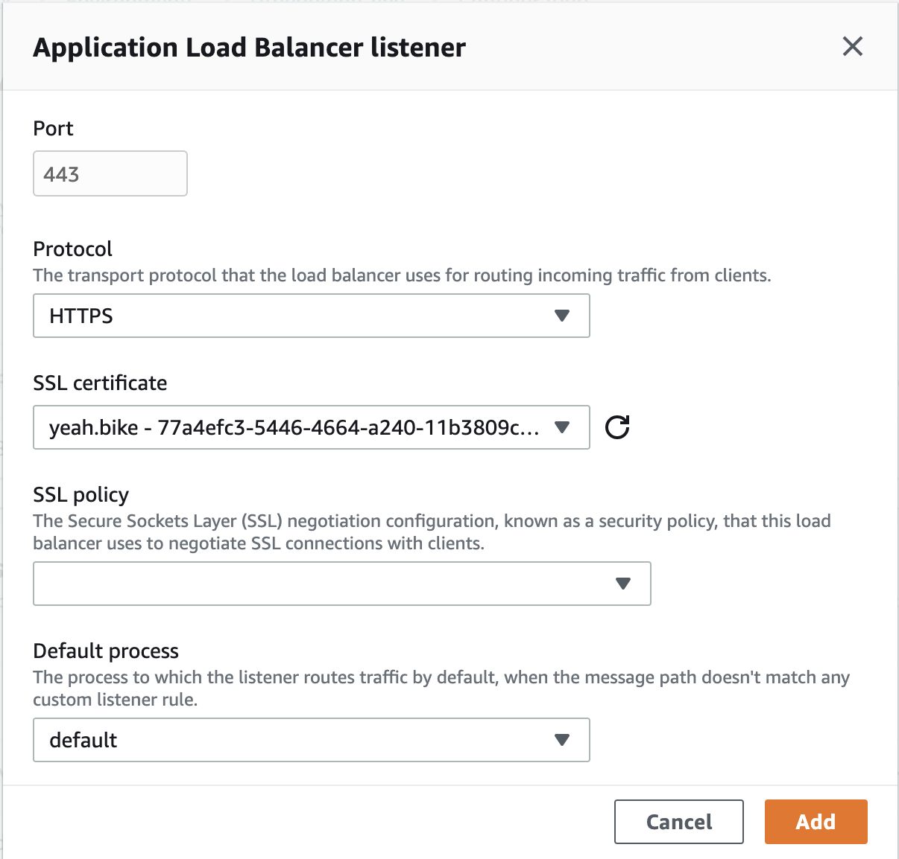

## LB
+ click LB > tab `Listeners` > choose `http:80` > click `View/edit rules` > edit > `THEN` choose `Redirect to...`
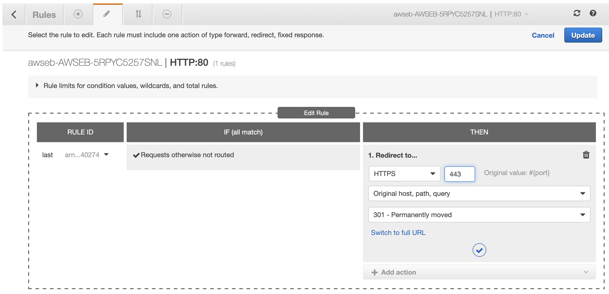
+ copy LB's name=`awseb-AWSEB-5RPYC5257SNL`
+ route53 > click `Create record`
+ 1. Record type=`A-IPv4`
+ 2. Alias=`Yes`
+ 3. Alias to LB
+ 4. region=`us-east-1`
+ 5. LB=`dualstack.awseb-AWSEB-5RPYC5257SNL.xxx`
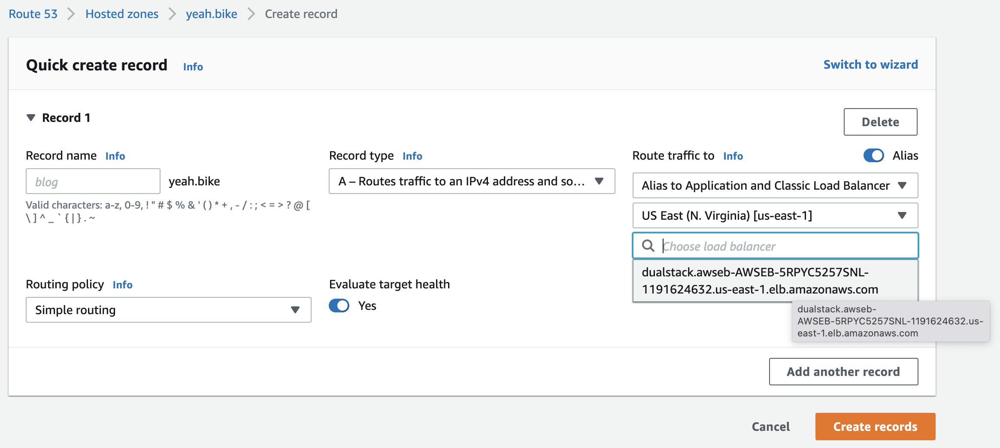

## SES
+ Account dashboard > click `Create SMTP credentials` > IAM User Name=`DTQ_SES_TEST_DELETE` > copy paste to `.env`: `MAIL_USERNAME` & `MAIL_PASSWORD`
+ Verified identities > Create identity:
+ 1. Identity type=`Email`
+ 2. Email=`email@gmail.com`
+ check inbox in `email@gmail.com` > click verify URL > Identity status=`Verified`
### A/ local
+ edit `.env` & eb `dtq-eb-blog` > Configuration > edit `Software`:
```shell
MAIL_MAILER=smtp
MAIL_HOST=email-smtp.us-east-1.amazonaws.com
MAIL_PORT=587
MAIL_USERNAME=xxx
MAIL_PASSWORD=yyy
MAIL_ENCRYPTION=tls
MAIL_FROM_ADDRESS=email@gmail.com
```
+ run CMD:
```shell
php artisan make:mail TestMail
```
+ create `resources/views/mails/test.blade.php`
+ edit `app/Mail/TestMail.php`
```php
return $this->view('mails.test');
```
+ edit `routes/web.php`
```php
Mail::to('email@gmail.com')->send(new TestMail());
```
+ run CMD:
```shell
php artisan serve
```
+ access `127.0.0.1` on browser and receive the email with content as `resources/views/mails/test.blade.php`:
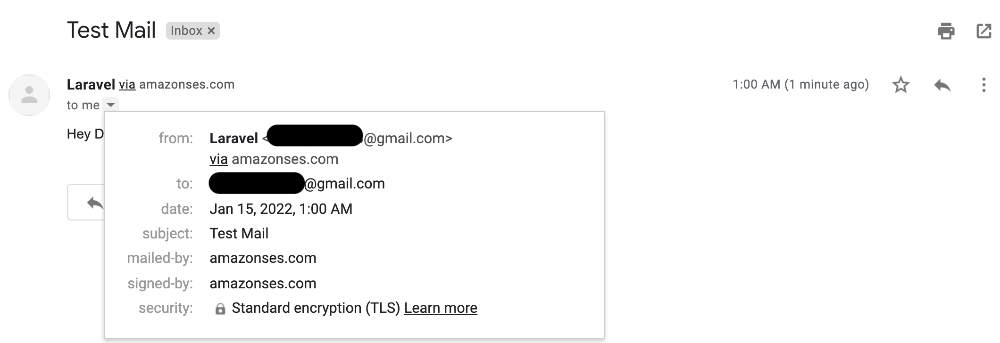
### B/ EB
+ edit `config/mail.php`
```php
'default' => array_key_exists('MAIL_MAILER', $_SERVER) ? $_SERVER['MAIL_MAILER'] : env('MAIL_MAILER'),

'mailers' => [
    'smtp' => [
        'transport' => 'smtp',
        'host' => array_key_exists('MAIL_HOST', $_SERVER) ? $_SERVER['MAIL_HOST'] : env('MAIL_HOST'),
        'port' => array_key_exists('MAIL_PORT', $_SERVER) ? $_SERVER['MAIL_PORT'] : env('MAIL_PORT'),
        'encryption' => array_key_exists('MAIL_ENCRYPTION', $_SERVER) ? $_SERVER['MAIL_ENCRYPTION'] : env('MAIL_ENCRYPTION'),
        'username' => array_key_exists('MAIL_USERNAME', $_SERVER) ? $_SERVER['MAIL_USERNAME'] : env('MAIL_USERNAME'),
        'password' => array_key_exists('MAIL_PASSWORD', $_SERVER) ? $_SERVER['MAIL_PASSWORD'] : env('MAIL_PASSWORD'),
        'timeout' => null,
        'auth_mode' => null,
    ],
```
+ push again, access eb's URL on browser and receive the email with content as `resources/views/mails/test.blade.php`

## bkp DB on S3
+
```shell
composer require spatie/laravel-backup:^6.11
```
> if ERR "memory exhauseted" then `COMPOSER_MEMORY_LIMIT=-1 composer require spatie/laravel-backup:^6.11`
+
```shell
php artisan vendor:publish --provider="Spatie\Backup\BackupServiceProvider"
-> will create `config/backup.php`
php artisan backup:run --help
php artisan backup:run --only-db
-> create `storage/app/Laravel/2022-01-14-18-04-29.zip`
```
> if ERR "Command not found : sh: 1: /mysqldump: not found" then:
```shell
brew install mysql-client
echo 'export PATH="/usr/local/opt/mysql-client/bin:$PATH"' >> ~/.bash_profile
ll /usr/local/opt/mysql-client/bin/mysqldump 
-> -r-xr-xr-x  1 NC00011462  admin  6831032  1 15 02:55 /usr/local/opt/mysql-client/bin/mysqldump
```
> edit `config/database.php`
```php
'dump' => [
    'dump_binary_path' => '/usr/local/opt/mysql-client/bin', // only the path, so without `mysqldump` or `pg_dump`
    'use_single_transaction',
    'timeout' => 60 * 5, // 5 minute timeout
]
```
+
```shell
composer require league/flysystem-aws-s3-v3:^1.0
```

## s3
### A/ local
+ create bucket=`dtq-s3-delete`
+ edit `.env` & eb `dtq-eb-blog` > Configuration > edit `Software`:
```shell
AWS_BUCKET=dtq-s3-delete
```
+ edit `config/backup.php`:
```php
disks' => [
    's3',
],
```
+
```shell
php artisan backup:run --only-db
-> create in S3: `Amazon S3 > dtq-s3-delete > Laravel/ > 2022-01-14-18-22-23.zip`
```
### B/ EB
+ edit `config/filesystems.php`:
```php
's3' => [
    'driver' => 's3',
    'key' => array_key_exists('AWS_ACCESS_KEY_ID', $_SERVER) ? $_SERVER['AWS_ACCESS_KEY_ID'] : env('AWS_ACCESS_KEY_ID'),
    'secret' => array_key_exists('AWS_SECRET_ACCESS_KEY', $_SERVER) ? $_SERVER['AWS_SECRET_ACCESS_KEY'] : env('AWS_SECRET_ACCESS_KEY'),
    'region' => array_key_exists('AWS_DEFAULT_REGION', $_SERVER) ? $_SERVER['AWS_DEFAULT_REGION'] : env('AWS_DEFAULT_REGION'),
    'bucket' => array_key_exists('AWS_BUCKET', $_SERVER) ? $_SERVER['AWS_BUCKET'] : env('AWS_BUCKET'),
    'url' => array_key_exists('AWS_URL', $_SERVER) ? $_SERVER['AWS_URL'] : env('AWS_URL'),
    'endpoint' => array_key_exists('AWS_ENDPOINT', $_SERVER) ? $_SERVER['AWS_ENDPOINT'] : env('AWS_ENDPOINT'),
],
```
+ create `.ebextensions/cronjob.config`
+ edit `app/Console/Kernel.php`:
```php
$schedule->command('backup:run --only-db')->dailyAt('4:00');
```
